# Projects and dependencies analysis

This document provides a comprehensive overview of the projects and their dependencies in the context of upgrading to .NETCoreApp,Version=v10.0.

## Table of Contents

- [Executive Summary](#executive-Summary)
  - [Highlevel Metrics](#highlevel-metrics)
  - [Projects Compatibility](#projects-compatibility)
  - [Package Compatibility](#package-compatibility)
  - [API Compatibility](#api-compatibility)
- [Aggregate NuGet packages details](#aggregate-nuget-packages-details)
- [Top API Migration Challenges](#top-api-migration-challenges)
  - [Technologies and Features](#technologies-and-features)
  - [Most Frequent API Issues](#most-frequent-api-issues)
- [Projects Relationship Graph](#projects-relationship-graph)
- [Project Details](#project-details)

  - [OptionA.Blazor.Blog.Builder\OptionA.Blazor.Blog.Builder.csproj](#optionablazorblogbuilderoptionablazorblogbuildercsproj)
  - [OptionA.Blazor.Blog.UnitTests\OptionA.Blazor.Blog.UnitTests.csproj](#optionablazorblogunittestsoptionablazorblogunittestscsproj)
  - [OptionA.Blazor.Blog\OptionA.Blazor.Blog.csproj](#optionablazorblogoptionablazorblogcsproj)
  - [OptionA.Blazor.Components.Direct\OptionA.Blazor.Components.Direct.csproj](#optionablazorcomponentsdirectoptionablazorcomponentsdirectcsproj)
  - [OptionA.Blazor.Components.UnitTests\OptionA.Blazor.Components.UnitTests.csproj](#optionablazorcomponentsunittestsoptionablazorcomponentsunittestscsproj)
  - [OptionA.Blazor.Components\OptionA.Blazor.Components.csproj](#optionablazorcomponentsoptionablazorcomponentscsproj)
  - [OptionA.Blazor.Maui.Test\OptionA.Blazor.Maui.Test.csproj](#optionablazormauitestoptionablazormauitestcsproj)
  - [OptionA.Blazor.Storage.Contracts\OptionA.Blazor.Storage.Contracts.csproj](#optionablazorstoragecontractsoptionablazorstoragecontractscsproj)
  - [OptionA.Blazor.Storage\OptionA.Blazor.Storage.csproj](#optionablazorstorageoptionablazorstoragecsproj)
  - [OptionA.Blazor.Test\OptionA.Blazor.Test.csproj](#optionablazortestoptionablazortestcsproj)

## Executive Summary

### Highlevel Metrics

| Metric | Count | Status |
| :--- | :---: | :--- |
| Total Projects | 10 | All require upgrade |
| Total NuGet Packages | 15 | 7 need upgrade |
| Total Code Files | 256 |  |
| Total Code Files with Incidents | 21 |  |
| Total Lines of Code | 16726 |  |
| Total Number of Issues | 98 |  |
| Estimated LOC to modify | 78+ | at least 0,5% of codebase |

### Projects Compatibility

| Project | Target Framework | Difficulty | Package Issues | API Issues | Est. LOC Impact | Description |
| :--- | :---: | :---: | :---: | :---: | :---: | :--- |
| [OptionA.Blazor.Blog.Builder\OptionA.Blazor.Blog.Builder.csproj](#optionablazorblogbuilderoptionablazorblogbuildercsproj) | net9.0 | 🟢 Low | 1 | 0 |  | ClassLibrary, Sdk Style = True |
| [OptionA.Blazor.Blog.UnitTests\OptionA.Blazor.Blog.UnitTests.csproj](#optionablazorblogunittestsoptionablazorblogunittestscsproj) | net9.0 | 🟢 Low | 0 | 0 |  | DotNetCoreApp, Sdk Style = True |
| [OptionA.Blazor.Blog\OptionA.Blazor.Blog.csproj](#optionablazorblogoptionablazorblogcsproj) | net9.0 | 🟢 Low | 1 | 1 | 1+ | ClassLibrary, Sdk Style = True |
| [OptionA.Blazor.Components.Direct\OptionA.Blazor.Components.Direct.csproj](#optionablazorcomponentsdirectoptionablazorcomponentsdirectcsproj) | net9.0 | 🟢 Low | 1 | 0 |  | ClassLibrary, Sdk Style = True |
| [OptionA.Blazor.Components.UnitTests\OptionA.Blazor.Components.UnitTests.csproj](#optionablazorcomponentsunittestsoptionablazorcomponentsunittestscsproj) | net9.0 | 🟢 Low | 0 | 0 |  | DotNetCoreApp, Sdk Style = True |
| [OptionA.Blazor.Components\OptionA.Blazor.Components.csproj](#optionablazorcomponentsoptionablazorcomponentscsproj) | net9.0 | 🟢 Low | 1 | 0 |  | ClassLibrary, Sdk Style = True |
| [OptionA.Blazor.Maui.Test\OptionA.Blazor.Maui.Test.csproj](#optionablazormauitestoptionablazormauitestcsproj) | net9.0-windows10.0.19041.0 | 🟢 Low | 1 | 74 | 74+ | WinForms, Sdk Style = True |
| [OptionA.Blazor.Storage.Contracts\OptionA.Blazor.Storage.Contracts.csproj](#optionablazorstoragecontractsoptionablazorstoragecontractscsproj) | netstandard2.1 | 🟢 Low | 2 | 0 |  | ClassLibrary, Sdk Style = True |
| [OptionA.Blazor.Storage\OptionA.Blazor.Storage.csproj](#optionablazorstorageoptionablazorstoragecsproj) | net9.0 | 🟢 Low | 2 | 0 |  | ClassLibrary, Sdk Style = True |
| [OptionA.Blazor.Test\OptionA.Blazor.Test.csproj](#optionablazortestoptionablazortestcsproj) | net9.0 | 🟢 Low | 2 | 3 | 3+ | AspNetCore, Sdk Style = True |

### Package Compatibility

| Status | Count | Percentage |
| :--- | :---: | :---: |
| ✅ Compatible | 8 | 53,3% |
| ⚠️ Incompatible | 0 | 0,0% |
| 🔄 Upgrade Recommended | 7 | 46,7% |
| ***Total NuGet Packages*** | ***15*** | ***100%*** |

### API Compatibility

| Category | Count | Impact |
| :--- | :---: | :--- |
| 🔴 Binary Incompatible | 3 | High - Require code changes |
| 🟡 Source Incompatible | 69 | Medium - Needs re-compilation and potential conflicting API error fixing |
| 🔵 Behavioral change | 6 | Low - Behavioral changes that may require testing at runtime |
| ✅ Compatible | 28992 |  |
| ***Total APIs Analyzed*** | ***29070*** |  |

## Aggregate NuGet packages details

| Package | Current Version | Suggested Version | Projects | Description |
| :--- | :---: | :---: | :--- | :--- |
| bunit | 1.38.5 |  | [OptionA.Blazor.Blog.UnitTests.csproj](#optionablazorblogunittestsoptionablazorblogunittestscsproj) [OptionA.Blazor.Components.UnitTests.csproj](#optionablazorcomponentsunittestsoptionablazorcomponentsunittestscsproj) | ✅Compatible |
| coverlet.collector | 6.0.4 |  | [OptionA.Blazor.Blog.UnitTests.csproj](#optionablazorblogunittestsoptionablazorblogunittestscsproj) [OptionA.Blazor.Components.UnitTests.csproj](#optionablazorcomponentsunittestsoptionablazorcomponentsunittestscsproj) | ✅Compatible |
| Microsoft.AspNetCore.Components.Web | 9.0.1 | 10.0.1 | [OptionA.Blazor.Blog.Builder.csproj](#optionablazorblogbuilderoptionablazorblogbuildercsproj) [OptionA.Blazor.Blog.csproj](#optionablazorblogoptionablazorblogcsproj) [OptionA.Blazor.Components.csproj](#optionablazorcomponentsoptionablazorcomponentscsproj) [OptionA.Blazor.Components.Direct.csproj](#optionablazorcomponentsdirectoptionablazorcomponentsdirectcsproj) [OptionA.Blazor.Storage.csproj](#optionablazorstorageoptionablazorstoragecsproj) | NuGet package upgrade is recommended |
| Microsoft.AspNetCore.Components.WebAssembly | 9.0.1 | 10.0.1 | [OptionA.Blazor.Test.csproj](#optionablazortestoptionablazortestcsproj) | NuGet package upgrade is recommended |
| Microsoft.AspNetCore.Components.WebAssembly.DevServer | 9.0.1 | 10.0.1 | [OptionA.Blazor.Test.csproj](#optionablazortestoptionablazortestcsproj) | NuGet package upgrade is recommended |
| Microsoft.AspNetCore.Components.WebView.Maui | 9.0.30 |  | [OptionA.Blazor.Maui.Test.csproj](#optionablazormauitestoptionablazormauitestcsproj) | ✅Compatible |
| Microsoft.Extensions.Configuration.Binder | 9.0.1 | 10.0.1 | [OptionA.Blazor.Storage.csproj](#optionablazorstorageoptionablazorstoragecsproj) | NuGet package upgrade is recommended |
| Microsoft.Extensions.DependencyInjection.Abstractions | 9.0.1 | 10.0.1 | [OptionA.Blazor.Storage.Contracts.csproj](#optionablazorstoragecontractsoptionablazorstoragecontractscsproj) | NuGet package upgrade is recommended |
| Microsoft.Extensions.Logging.Debug | 9.0.1 | 10.0.1 | [OptionA.Blazor.Maui.Test.csproj](#optionablazormauitestoptionablazormauitestcsproj) | NuGet package upgrade is recommended |
| Microsoft.Maui.Controls | 9.0.30 |  | [OptionA.Blazor.Maui.Test.csproj](#optionablazormauitestoptionablazormauitestcsproj) | ✅Compatible |
| Microsoft.NET.Test.Sdk | 17.12.0 |  | [OptionA.Blazor.Blog.UnitTests.csproj](#optionablazorblogunittestsoptionablazorblogunittestscsproj) [OptionA.Blazor.Components.UnitTests.csproj](#optionablazorcomponentsunittestsoptionablazorcomponentsunittestscsproj) | ✅Compatible |
| Moq | 4.20.72 |  | [OptionA.Blazor.Blog.UnitTests.csproj](#optionablazorblogunittestsoptionablazorblogunittestscsproj) [OptionA.Blazor.Components.UnitTests.csproj](#optionablazorcomponentsunittestsoptionablazorcomponentsunittestscsproj) | ✅Compatible |
| System.Text.Json | 9.0.1 | 10.0.1 | [OptionA.Blazor.Storage.Contracts.csproj](#optionablazorstoragecontractsoptionablazorstoragecontractscsproj) | NuGet package upgrade is recommended |
| xunit | 2.9.3 |  | [OptionA.Blazor.Blog.UnitTests.csproj](#optionablazorblogunittestsoptionablazorblogunittestscsproj) [OptionA.Blazor.Components.UnitTests.csproj](#optionablazorcomponentsunittestsoptionablazorcomponentsunittestscsproj) | ✅Compatible |
| xunit.runner.visualstudio | 3.0.1 |  | [OptionA.Blazor.Blog.UnitTests.csproj](#optionablazorblogunittestsoptionablazorblogunittestscsproj) [OptionA.Blazor.Components.UnitTests.csproj](#optionablazorcomponentsunittestsoptionablazorcomponentsunittestscsproj) | ✅Compatible |

## Top API Migration Challenges

### Technologies and Features

| Technology | Issues | Percentage | Migration Path |
| :--- | :---: | :---: | :--- |

### Most Frequent API Issues

| API | Count | Percentage | Category |
| :--- | :---: | :---: | :--- |
| T:Microsoft.Maui.Controls.BindingMode | 20 | 25,6% | Source Incompatible |
| T:Microsoft.Maui.Hosting.MauiApp | 5 | 6,4% | Source Incompatible |
| P:Microsoft.Maui.Hosting.MauiAppBuilder.Services | 4 | 5,1% | Source Incompatible |
| F:Microsoft.Maui.Controls.BindingMode.TwoWay | 3 | 3,8% | Source Incompatible |
| F:Microsoft.Maui.Controls.BindingMode.OneWayToSource | 3 | 3,8% | Source Incompatible |
| T:System.Uri | 3 | 3,8% | Behavioral Change |
| T:Microsoft.Maui.Hosting.MauiAppBuilder | 3 | 3,8% | Source Incompatible |
| F:Microsoft.Maui.Controls.BindingMode.Default | 2 | 2,6% | Source Incompatible |
| P:Microsoft.Maui.Controls.BindableProperty.DefaultBindingMode | 2 | 2,6% | Source Incompatible |
| M:System.Uri.#ctor(System.String) | 2 | 2,6% | Behavioral Change |
| M:Microsoft.Maui.MauiWinUIApplication.#ctor | 2 | 2,6% | Binary Incompatible |
| T:Microsoft.Maui.Controls.Xaml.Extensions | 2 | 2,6% | Source Incompatible |
| M:Microsoft.Maui.Controls.ContentPage.#ctor | 2 | 2,6% | Source Incompatible |
| T:Microsoft.Maui.Controls.Window | 2 | 2,6% | Source Incompatible |
| M:Microsoft.Maui.Controls.Application.#ctor | 2 | 2,6% | Source Incompatible |
| M:System.String.Split(System.ReadOnlySpan{System.Char}) | 1 | 1,3% | Source Incompatible |
| T:Microsoft.Maui.Controls.BindableProperty | 1 | 1,3% | Source Incompatible |
| M:System.Environment.SetEnvironmentVariable(System.String,System.String) | 1 | 1,3% | Behavioral Change |
| T:Microsoft.Maui.MauiWinUIApplication | 1 | 1,3% | Binary Incompatible |
| T:Microsoft.Maui.Controls.NameScopeExtensions | 1 | 1,3% | Source Incompatible |
| M:Microsoft.Maui.Controls.NameScopeExtensions.FindByName''1(Microsoft.Maui.Controls.Element,System.String) | 1 | 1,3% | Source Incompatible |
| T:Microsoft.Maui.Controls.ContentPage | 1 | 1,3% | Source Incompatible |
| M:Microsoft.Maui.Hosting.MauiAppBuilder.Build | 1 | 1,3% | Source Incompatible |
| P:Microsoft.Maui.Hosting.MauiAppBuilder.Logging | 1 | 1,3% | Source Incompatible |
| T:Microsoft.Maui.Hosting.FontCollectionExtensions | 1 | 1,3% | Source Incompatible |
| T:Microsoft.Maui.Hosting.IFontCollection | 1 | 1,3% | Source Incompatible |
| M:Microsoft.Maui.Hosting.FontCollectionExtensions.AddFont(Microsoft.Maui.Hosting.IFontCollection,System.String,System.String) | 1 | 1,3% | Source Incompatible |
| T:Microsoft.Maui.Controls.Hosting.AppHostBuilderExtensions | 1 | 1,3% | Source Incompatible |
| M:Microsoft.Maui.Controls.Hosting.AppHostBuilderExtensions.UseMauiApp''1(Microsoft.Maui.Hosting.MauiAppBuilder) | 1 | 1,3% | Source Incompatible |
| T:Microsoft.Maui.Hosting.FontsMauiAppBuilderExtensions | 1 | 1,3% | Source Incompatible |
| M:Microsoft.Maui.Hosting.FontsMauiAppBuilderExtensions.ConfigureFonts(Microsoft.Maui.Hosting.MauiAppBuilder,System.Action{Microsoft.Maui.Hosting.IFontCollection}) | 1 | 1,3% | Source Incompatible |
| M:Microsoft.Maui.Hosting.MauiApp.CreateBuilder(System.Boolean) | 1 | 1,3% | Source Incompatible |
| T:Microsoft.Maui.IActivationState | 1 | 1,3% | Source Incompatible |
| P:Microsoft.Maui.Controls.Window.Title | 1 | 1,3% | Source Incompatible |
| M:Microsoft.Maui.Controls.Window.#ctor(Microsoft.Maui.Controls.Page) | 1 | 1,3% | Source Incompatible |
| T:Microsoft.Maui.Controls.Application | 1 | 1,3% | Source Incompatible |

## Projects Relationship Graph

Legend:
📦 SDK-style project
⚙️ Classic project

```mermaid
flowchart LR
    P1["<b>📦&nbsp;OptionA.Blazor.Storage.csproj</b><br/><small>net9.0</small>"]
    P2["<b>📦&nbsp;OptionA.Blazor.Storage.Contracts.csproj</b><br/><small>netstandard2.1</small>"]
    P3["<b>📦&nbsp;OptionA.Blazor.Components.csproj</b><br/><small>net9.0</small>"]
    P4["<b>📦&nbsp;OptionA.Blazor.Test.csproj</b><br/><small>net9.0</small>"]
    P5["<b>📦&nbsp;OptionA.Blazor.Blog.csproj</b><br/><small>net9.0</small>"]
    P6["<b>📦&nbsp;OptionA.Blazor.Blog.UnitTests.csproj</b><br/><small>net9.0</small>"]
    P7["<b>📦&nbsp;OptionA.Blazor.Blog.Builder.csproj</b><br/><small>net9.0</small>"]
    P8["<b>📦&nbsp;OptionA.Blazor.Components.Direct.csproj</b><br/><small>net9.0</small>"]
    P9["<b>📦&nbsp;OptionA.Blazor.Components.UnitTests.csproj</b><br/><small>net9.0</small>"]
    P10["<b>📦&nbsp;OptionA.Blazor.Maui.Test.csproj</b><br/><small>net9.0-windows10.0.19041.0</small>"]
    P1 --> P2
    P3 --> P8
    P4 --> P3
    P4 --> P1
    P4 --> P7
    P6 --> P5
    P7 --> P8
    P7 --> P5
    P9 --> P3
    P10 --> P3
    P10 --> P7
    click P1 "#optionablazorstorageoptionablazorstoragecsproj"
    click P2 "#optionablazorstoragecontractsoptionablazorstoragecontractscsproj"
    click P3 "#optionablazorcomponentsoptionablazorcomponentscsproj"
    click P4 "#optionablazortestoptionablazortestcsproj"
    click P5 "#optionablazorblogoptionablazorblogcsproj"
    click P6 "#optionablazorblogunittestsoptionablazorblogunittestscsproj"
    click P7 "#optionablazorblogbuilderoptionablazorblogbuildercsproj"
    click P8 "#optionablazorcomponentsdirectoptionablazorcomponentsdirectcsproj"
    click P9 "#optionablazorcomponentsunittestsoptionablazorcomponentsunittestscsproj"
    click P10 "#optionablazormauitestoptionablazormauitestcsproj"

```

## Project Details

### OptionA.Blazor.Blog.Builder\OptionA.Blazor.Blog.Builder.csproj

#### Project Info

- **Current Target Framework:** net9.0
- **Proposed Target Framework:** net10.0
- **SDK-style**: True
- **Project Kind:** ClassLibrary
- **Dependencies**: 2
- **Dependants**: 2
- **Number of Files**: 42
- **Number of Files with Incidents**: 1
- **Lines of Code**: 2839
- **Estimated LOC to modify**: 0+ (at least 0,0% of the project)

#### Dependency Graph

Legend:
📦 SDK-style project
⚙️ Classic project

```mermaid
flowchart TB
    subgraph upstream["Dependants (2)"]
        P4["<b>📦&nbsp;OptionA.Blazor.Test.csproj</b><br/><small>net9.0</small>"]
        P10["<b>📦&nbsp;OptionA.Blazor.Maui.Test.csproj</b><br/><small>net9.0-windows10.0.19041.0</small>"]
        click P4 "#optionablazortestoptionablazortestcsproj"
        click P10 "#optionablazormauitestoptionablazormauitestcsproj"
    end
    subgraph current["OptionA.Blazor.Blog.Builder.csproj"]
        MAIN["<b>📦&nbsp;OptionA.Blazor.Blog.Builder.csproj</b><br/><small>net9.0</small>"]
        click MAIN "#optionablazorblogbuilderoptionablazorblogbuildercsproj"
    end
    subgraph downstream["Dependencies (2"]
        P8["<b>📦&nbsp;OptionA.Blazor.Components.Direct.csproj</b><br/><small>net9.0</small>"]
        P5["<b>📦&nbsp;OptionA.Blazor.Blog.csproj</b><br/><small>net9.0</small>"]
        click P8 "#optionablazorcomponentsdirectoptionablazorcomponentsdirectcsproj"
        click P5 "#optionablazorblogoptionablazorblogcsproj"
    end
    P4 --> MAIN
    P10 --> MAIN
    MAIN --> P8
    MAIN --> P5

```

### API Compatibility

| Category | Count | Impact |
| :--- | :---: | :--- |
| 🔴 Binary Incompatible | 0 | High - Require code changes |
| 🟡 Source Incompatible | 0 | Medium - Needs re-compilation and potential conflicting API error fixing |
| 🔵 Behavioral change | 0 | Low - Behavioral changes that may require testing at runtime |
| ✅ Compatible | 7532 |  |
| ***Total APIs Analyzed*** | ***7532*** |  |

### OptionA.Blazor.Blog.UnitTests\OptionA.Blazor.Blog.UnitTests.csproj

#### Project Info

- **Current Target Framework:** net9.0
- **Proposed Target Framework:** net10.0
- **SDK-style**: True
- **Project Kind:** DotNetCoreApp
- **Dependencies**: 1
- **Dependants**: 0
- **Number of Files**: 4
- **Number of Files with Incidents**: 1
- **Lines of Code**: 52
- **Estimated LOC to modify**: 0+ (at least 0,0% of the project)

#### Dependency Graph

Legend:
📦 SDK-style project
⚙️ Classic project

```mermaid
flowchart TB
    subgraph current["OptionA.Blazor.Blog.UnitTests.csproj"]
        MAIN["<b>📦&nbsp;OptionA.Blazor.Blog.UnitTests.csproj</b><br/><small>net9.0</small>"]
        click MAIN "#optionablazorblogunittestsoptionablazorblogunittestscsproj"
    end
    subgraph downstream["Dependencies (1"]
        P5["<b>📦&nbsp;OptionA.Blazor.Blog.csproj</b><br/><small>net9.0</small>"]
        click P5 "#optionablazorblogoptionablazorblogcsproj"
    end
    MAIN --> P5

```

### API Compatibility

| Category | Count | Impact |
| :--- | :---: | :--- |
| 🔴 Binary Incompatible | 0 | High - Require code changes |
| 🟡 Source Incompatible | 0 | Medium - Needs re-compilation and potential conflicting API error fixing |
| 🔵 Behavioral change | 0 | Low - Behavioral changes that may require testing at runtime |
| ✅ Compatible | 125 |  |
| ***Total APIs Analyzed*** | ***125*** |  |

### OptionA.Blazor.Blog\OptionA.Blazor.Blog.csproj

#### Project Info

- **Current Target Framework:** net9.0
- **Proposed Target Framework:** net10.0
- **SDK-style**: True
- **Project Kind:** ClassLibrary
- **Dependencies**: 0
- **Dependants**: 2
- **Number of Files**: 89
- **Number of Files with Incidents**: 2
- **Lines of Code**: 3859
- **Estimated LOC to modify**: 1+ (at least 0,0% of the project)

#### Dependency Graph

Legend:
📦 SDK-style project
⚙️ Classic project

```mermaid
flowchart TB
    subgraph upstream["Dependants (2)"]
        P6["<b>📦&nbsp;OptionA.Blazor.Blog.UnitTests.csproj</b><br/><small>net9.0</small>"]
        P7["<b>📦&nbsp;OptionA.Blazor.Blog.Builder.csproj</b><br/><small>net9.0</small>"]
        click P6 "#optionablazorblogunittestsoptionablazorblogunittestscsproj"
        click P7 "#optionablazorblogbuilderoptionablazorblogbuildercsproj"
    end
    subgraph current["OptionA.Blazor.Blog.csproj"]
        MAIN["<b>📦&nbsp;OptionA.Blazor.Blog.csproj</b><br/><small>net9.0</small>"]
        click MAIN "#optionablazorblogoptionablazorblogcsproj"
    end
    P6 --> MAIN
    P7 --> MAIN

```

### API Compatibility

| Category | Count | Impact |
| :--- | :---: | :--- |
| 🔴 Binary Incompatible | 0 | High - Require code changes |
| 🟡 Source Incompatible | 1 | Medium - Needs re-compilation and potential conflicting API error fixing |
| 🔵 Behavioral change | 0 | Low - Behavioral changes that may require testing at runtime |
| ✅ Compatible | 3083 |  |
| ***Total APIs Analyzed*** | ***3084*** |  |

### OptionA.Blazor.Components.Direct\OptionA.Blazor.Components.Direct.csproj

#### Project Info

- **Current Target Framework:** net9.0
- **Proposed Target Framework:** net10.0
- **SDK-style**: True
- **Project Kind:** ClassLibrary
- **Dependencies**: 0
- **Dependants**: 2
- **Number of Files**: 33
- **Number of Files with Incidents**: 1
- **Lines of Code**: 1581
- **Estimated LOC to modify**: 0+ (at least 0,0% of the project)

#### Dependency Graph

Legend:
📦 SDK-style project
⚙️ Classic project

```mermaid
flowchart TB
    subgraph upstream["Dependants (2)"]
        P3["<b>📦&nbsp;OptionA.Blazor.Components.csproj</b><br/><small>net9.0</small>"]
        P7["<b>📦&nbsp;OptionA.Blazor.Blog.Builder.csproj</b><br/><small>net9.0</small>"]
        click P3 "#optionablazorcomponentsoptionablazorcomponentscsproj"
        click P7 "#optionablazorblogbuilderoptionablazorblogbuildercsproj"
    end
    subgraph current["OptionA.Blazor.Components.Direct.csproj"]
        MAIN["<b>📦&nbsp;OptionA.Blazor.Components.Direct.csproj</b><br/><small>net9.0</small>"]
        click MAIN "#optionablazorcomponentsdirectoptionablazorcomponentsdirectcsproj"
    end
    P3 --> MAIN
    P7 --> MAIN

```

### API Compatibility

| Category | Count | Impact |
| :--- | :---: | :--- |
| 🔴 Binary Incompatible | 0 | High - Require code changes |
| 🟡 Source Incompatible | 0 | Medium - Needs re-compilation and potential conflicting API error fixing |
| 🔵 Behavioral change | 0 | Low - Behavioral changes that may require testing at runtime |
| ✅ Compatible | 2558 |  |
| ***Total APIs Analyzed*** | ***2558*** |  |

### OptionA.Blazor.Components.UnitTests\OptionA.Blazor.Components.UnitTests.csproj

#### Project Info

- **Current Target Framework:** net9.0
- **Proposed Target Framework:** net10.0
- **SDK-style**: True
- **Project Kind:** DotNetCoreApp
- **Dependencies**: 1
- **Dependants**: 0
- **Number of Files**: 4
- **Number of Files with Incidents**: 1
- **Lines of Code**: 76
- **Estimated LOC to modify**: 0+ (at least 0,0% of the project)

#### Dependency Graph

Legend:
📦 SDK-style project
⚙️ Classic project

```mermaid
flowchart TB
    subgraph current["OptionA.Blazor.Components.UnitTests.csproj"]
        MAIN["<b>📦&nbsp;OptionA.Blazor.Components.UnitTests.csproj</b><br/><small>net9.0</small>"]
        click MAIN "#optionablazorcomponentsunittestsoptionablazorcomponentsunittestscsproj"
    end
    subgraph downstream["Dependencies (1"]
        P3["<b>📦&nbsp;OptionA.Blazor.Components.csproj</b><br/><small>net9.0</small>"]
        click P3 "#optionablazorcomponentsoptionablazorcomponentscsproj"
    end
    MAIN --> P3

```

### API Compatibility

| Category | Count | Impact |
| :--- | :---: | :--- |
| 🔴 Binary Incompatible | 0 | High - Require code changes |
| 🟡 Source Incompatible | 0 | Medium - Needs re-compilation and potential conflicting API error fixing |
| 🔵 Behavioral change | 0 | Low - Behavioral changes that may require testing at runtime |
| ✅ Compatible | 156 |  |
| ***Total APIs Analyzed*** | ***156*** |  |

### OptionA.Blazor.Components\OptionA.Blazor.Components.csproj

#### Project Info

- **Current Target Framework:** net9.0
- **Proposed Target Framework:** net10.0
- **SDK-style**: True
- **Project Kind:** ClassLibrary
- **Dependencies**: 1
- **Dependants**: 3
- **Number of Files**: 96
- **Number of Files with Incidents**: 1
- **Lines of Code**: 5726
- **Estimated LOC to modify**: 0+ (at least 0,0% of the project)

#### Dependency Graph

Legend:
📦 SDK-style project
⚙️ Classic project

```mermaid
flowchart TB
    subgraph upstream["Dependants (3)"]
        P4["<b>📦&nbsp;OptionA.Blazor.Test.csproj</b><br/><small>net9.0</small>"]
        P9["<b>📦&nbsp;OptionA.Blazor.Components.UnitTests.csproj</b><br/><small>net9.0</small>"]
        P10["<b>📦&nbsp;OptionA.Blazor.Maui.Test.csproj</b><br/><small>net9.0-windows10.0.19041.0</small>"]
        click P4 "#optionablazortestoptionablazortestcsproj"
        click P9 "#optionablazorcomponentsunittestsoptionablazorcomponentsunittestscsproj"
        click P10 "#optionablazormauitestoptionablazormauitestcsproj"
    end
    subgraph current["OptionA.Blazor.Components.csproj"]
        MAIN["<b>📦&nbsp;OptionA.Blazor.Components.csproj</b><br/><small>net9.0</small>"]
        click MAIN "#optionablazorcomponentsoptionablazorcomponentscsproj"
    end
    subgraph downstream["Dependencies (1"]
        P8["<b>📦&nbsp;OptionA.Blazor.Components.Direct.csproj</b><br/><small>net9.0</small>"]
        click P8 "#optionablazorcomponentsdirectoptionablazorcomponentsdirectcsproj"
    end
    P4 --> MAIN
    P9 --> MAIN
    P10 --> MAIN
    MAIN --> P8

```

### API Compatibility

| Category | Count | Impact |
| :--- | :---: | :--- |
| 🔴 Binary Incompatible | 0 | High - Require code changes |
| 🟡 Source Incompatible | 0 | Medium - Needs re-compilation and potential conflicting API error fixing |
| 🔵 Behavioral change | 0 | Low - Behavioral changes that may require testing at runtime |
| ✅ Compatible | 6502 |  |
| ***Total APIs Analyzed*** | ***6502*** |  |

### OptionA.Blazor.Maui.Test\OptionA.Blazor.Maui.Test.csproj

#### Project Info

- **Current Target Framework:** net9.0-windows10.0.19041.0
- **Proposed Target Framework:** net10.0-windows10.0.22000.0
- **SDK-style**: True
- **Project Kind:** WinForms
- **Dependencies**: 2
- **Dependants**: 0
- **Number of Files**: 47
- **Number of Files with Incidents**: 10
- **Lines of Code**: 651
- **Estimated LOC to modify**: 74+ (at least 11,4% of the project)

#### Dependency Graph

Legend:
📦 SDK-style project
⚙️ Classic project

```mermaid
flowchart TB
    subgraph current["OptionA.Blazor.Maui.Test.csproj"]
        MAIN["<b>📦&nbsp;OptionA.Blazor.Maui.Test.csproj</b><br/><small>net9.0-windows10.0.19041.0</small>"]
        click MAIN "#optionablazormauitestoptionablazormauitestcsproj"
    end
    subgraph downstream["Dependencies (2"]
        P3["<b>📦&nbsp;OptionA.Blazor.Components.csproj</b><br/><small>net9.0</small>"]
        P7["<b>📦&nbsp;OptionA.Blazor.Blog.Builder.csproj</b><br/><small>net9.0</small>"]
        click P3 "#optionablazorcomponentsoptionablazorcomponentscsproj"
        click P7 "#optionablazorblogbuilderoptionablazorblogbuildercsproj"
    end
    MAIN --> P3
    MAIN --> P7

```

### API Compatibility

| Category | Count | Impact |
| :--- | :---: | :--- |
| 🔴 Binary Incompatible | 3 | High - Require code changes |
| 🟡 Source Incompatible | 68 | Medium - Needs re-compilation and potential conflicting API error fixing |
| 🔵 Behavioral change | 3 | Low - Behavioral changes that may require testing at runtime |
| ✅ Compatible | 4174 |  |
| ***Total APIs Analyzed*** | ***4248*** |  |

### OptionA.Blazor.Storage.Contracts\OptionA.Blazor.Storage.Contracts.csproj

#### Project Info

- **Current Target Framework:** netstandard2.1✅
- **SDK-style**: True
- **Project Kind:** ClassLibrary
- **Dependencies**: 0
- **Dependants**: 1
- **Number of Files**: 16
- **Number of Files with Incidents**: 1
- **Lines of Code**: 569
- **Estimated LOC to modify**: 0+ (at least 0,0% of the project)

#### Dependency Graph

Legend:
📦 SDK-style project
⚙️ Classic project

```mermaid
flowchart TB
    subgraph upstream["Dependants (1)"]
        P1["<b>📦&nbsp;OptionA.Blazor.Storage.csproj</b><br/><small>net9.0</small>"]
        click P1 "#optionablazorstorageoptionablazorstoragecsproj"
    end
    subgraph current["OptionA.Blazor.Storage.Contracts.csproj"]
        MAIN["<b>📦&nbsp;OptionA.Blazor.Storage.Contracts.csproj</b><br/><small>netstandard2.1</small>"]
        click MAIN "#optionablazorstoragecontractsoptionablazorstoragecontractscsproj"
    end
    P1 --> MAIN

```

### API Compatibility

| Category | Count | Impact |
| :--- | :---: | :--- |
| 🔴 Binary Incompatible | 0 | High - Require code changes |
| 🟡 Source Incompatible | 0 | Medium - Needs re-compilation and potential conflicting API error fixing |
| 🔵 Behavioral change | 0 | Low - Behavioral changes that may require testing at runtime |
| ✅ Compatible | 226 |  |
| ***Total APIs Analyzed*** | ***226*** |  |

### OptionA.Blazor.Storage\OptionA.Blazor.Storage.csproj

#### Project Info

- **Current Target Framework:** net9.0
- **Proposed Target Framework:** net10.0
- **SDK-style**: True
- **Project Kind:** ClassLibrary
- **Dependencies**: 1
- **Dependants**: 1
- **Number of Files**: 15
- **Number of Files with Incidents**: 1
- **Lines of Code**: 711
- **Estimated LOC to modify**: 0+ (at least 0,0% of the project)

#### Dependency Graph

Legend:
📦 SDK-style project
⚙️ Classic project

```mermaid
flowchart TB
    subgraph upstream["Dependants (1)"]
        P4["<b>📦&nbsp;OptionA.Blazor.Test.csproj</b><br/><small>net9.0</small>"]
        click P4 "#optionablazortestoptionablazortestcsproj"
    end
    subgraph current["OptionA.Blazor.Storage.csproj"]
        MAIN["<b>📦&nbsp;OptionA.Blazor.Storage.csproj</b><br/><small>net9.0</small>"]
        click MAIN "#optionablazorstorageoptionablazorstoragecsproj"
    end
    subgraph downstream["Dependencies (1"]
        P2["<b>📦&nbsp;OptionA.Blazor.Storage.Contracts.csproj</b><br/><small>netstandard2.1</small>"]
        click P2 "#optionablazorstoragecontractsoptionablazorstoragecontractscsproj"
    end
    P4 --> MAIN
    MAIN --> P2

```

### API Compatibility

| Category | Count | Impact |
| :--- | :---: | :--- |
| 🔴 Binary Incompatible | 0 | High - Require code changes |
| 🟡 Source Incompatible | 0 | Medium - Needs re-compilation and potential conflicting API error fixing |
| 🔵 Behavioral change | 0 | Low - Behavioral changes that may require testing at runtime |
| ✅ Compatible | 694 |  |
| ***Total APIs Analyzed*** | ***694*** |  |

### OptionA.Blazor.Test\OptionA.Blazor.Test.csproj

#### Project Info

- **Current Target Framework:** net9.0
- **Proposed Target Framework:** net10.0
- **SDK-style**: True
- **Project Kind:** AspNetCore
- **Dependencies**: 3
- **Dependants**: 0
- **Number of Files**: 45
- **Number of Files with Incidents**: 2
- **Lines of Code**: 662
- **Estimated LOC to modify**: 3+ (at least 0,5% of the project)

#### Dependency Graph

Legend:
📦 SDK-style project
⚙️ Classic project

```mermaid
flowchart TB
    subgraph current["OptionA.Blazor.Test.csproj"]
        MAIN["<b>📦&nbsp;OptionA.Blazor.Test.csproj</b><br/><small>net9.0</small>"]
        click MAIN "#optionablazortestoptionablazortestcsproj"
    end
    subgraph downstream["Dependencies (3"]
        P3["<b>📦&nbsp;OptionA.Blazor.Components.csproj</b><br/><small>net9.0</small>"]
        P1["<b>📦&nbsp;OptionA.Blazor.Storage.csproj</b><br/><small>net9.0</small>"]
        P7["<b>📦&nbsp;OptionA.Blazor.Blog.Builder.csproj</b><br/><small>net9.0</small>"]
        click P3 "#optionablazorcomponentsoptionablazorcomponentscsproj"
        click P1 "#optionablazorstorageoptionablazorstoragecsproj"
        click P7 "#optionablazorblogbuilderoptionablazorblogbuildercsproj"
    end
    MAIN --> P3
    MAIN --> P1
    MAIN --> P7

```

### API Compatibility

| Category | Count | Impact |
| :--- | :---: | :--- |
| 🔴 Binary Incompatible | 0 | High - Require code changes |
| 🟡 Source Incompatible | 0 | Medium - Needs re-compilation and potential conflicting API error fixing |
| 🔵 Behavioral change | 3 | Low - Behavioral changes that may require testing at runtime |
| ✅ Compatible | 3942 |  |
| ***Total APIs Analyzed*** | ***3945*** |  |

